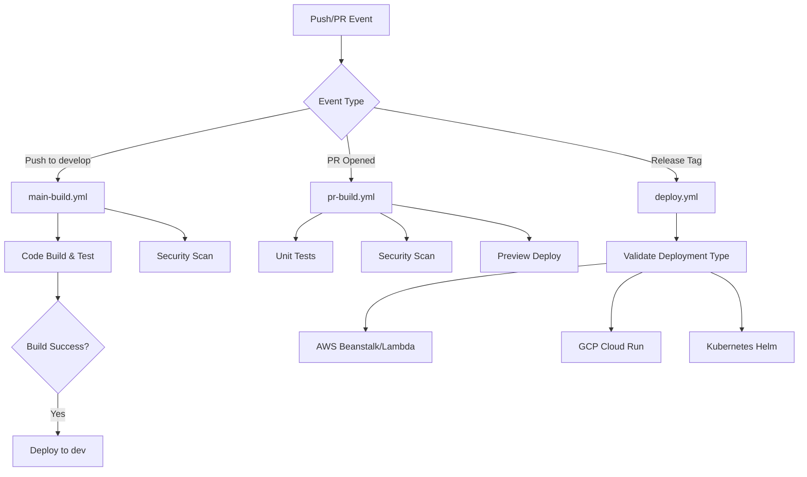

# NodeJS Application Template - Complete Documentation

A production-ready Node.js application template with GitOps-driven CI/CD pipelines using GitHub Actions and the Cloud Ops Works Blueprint framework.

## Table of Contents

1. [Overview](#overview)
2. [Blueprint Framework](#blueprint-framework)
3. [Module Configuration (.cloudopsworks/vars)](#module-configuration-cloudopsworksvars)
4. [CI Pipeline Configuration (cloudopsworks-ci.yaml)](#ci-pipeline-configuration-cloudopsworks-ciyaml)
5. [Environment-Specific Configurations](#environment-specific-configurations)
6. [Helm Chart Configuration](#helm-chart-configuration)
7. [API Gateway Configuration](#api-gateway-configuration)
8. [Workflows and Actions](#workflows-and-actions)
9. [Node.js Application Overview](#nodejs-application-overview)

---

## 1. Overview

This template provides a complete CI/CD solution for Node.js applications with support for multiple deployment targets:

- **AWS**: Beanstalk, Lambda, EKS
- **GCP**: Cloud Run, App Engine
- **Azure**: Kubernetes (AKS), Web Apps

The template uses the [Cloud Ops Works Blueprints](https://github.com/cloudopsworks/blueprints.git) framework for standardized GitHub Actions workflows.

### Key Features

- Automated build, test, and deployment pipelines
- Security scanning (Snyk, Semgrep, SonarQube, Dependency Track)
- Multi-environment support (dev, uat, prod, demo)
- GitFlow branch strategy integration
- Preview environments for pull requests
- API Gateway integration
- Observability support (X-Ray, New Relic, Datadog, Dynatrace)
- JIRA integration for release management

---

## 2. Blueprint Framework

The template utilizes reusable GitHub Actions from the Cloud Ops Works Blueprints repository. These actions are referenced using the `./bp` prefix in workflow files.

### Available Blueprint Actions

Blueprint actions are organized into two main categories:

#### CD (Continuous Deployment) Actions
- `cloudopsworks/blueprints/cd/checkout@v5.10` - Repository checkout with blueprint integration
- Actions for environment management, deployment strategies, and infrastructure provisioning

#### CI (Continuous Integration) Actions
- `./bp/ci/config` - Pipeline configuration extraction
- `./bp/ci/nodejs/config` - Node.js specific configuration
- `./bp/ci/nodejs/build` - Build and test execution
- `./bp/ci/nodejs/deploy` - Deployment execution
- `./bp/ci/scan/config` - Security scanning configuration

### Workflow Integration Pattern

All workflows follow a consistent pattern when referencing blueprint actions:

```yaml
- name: Checkout w/Blueprint
  uses: cloudopsworks/blueprints/cd/checkout@v5.10
  with:
    blueprint_ref: 'v5.10'

- name: Pipeline Configuration
  id: config
  uses: ./bp/ci/config
```

The `blueprint_ref` parameter specifies which version of the blueprints to use, allowing for controlled updates and testing of new features.

---

## 3. Module Configuration (.cloudopsworks/vars)

All configuration is organized in the `.cloudopsworks/vars` directory with a clear separation between global settings and environment-specific configurations.

### File Structure

```
.cloudopsworks/vars/
├── inputs-global.yaml          # Base configuration (required for all environments)
├── inputs-APPENGINE.yaml       # Google App Engine deployment config
├── inputs-BEANSTALK-ENV.yaml   # AWS Beanstalk deployment config
├── inputs-CLOUDRUN.yaml        # GCP Cloud Run deployment config
├── inputs-KUBERNETES-ENV.yaml  # Kubernetes/EKS/AKS deployment config
├── inputs-LAMBDA-ENV.yaml      # AWS Lambda deployment config
├── inputs-LIB-ENV.yaml         # Library project configuration
├── apigw/                     # API Gateway configurations
│   ├── apis-global.yaml
│   ├── apis-dev.yaml
│   ├── apis-uat.yaml
│   └── apis-prod.yaml
└── helm/                      # Helm chart values
    ├── values-dev.yaml
    ├── values-uat.yaml
    └── values-prod.yaml
```

---

## 4. CI Pipeline Configuration (cloudopsworks-ci.yaml)

The `cloudopsworks-ci.yaml` file in `.cloudopsworks/` defines pipeline-wide settings and deployment environment mappings. This configuration is independent of the input files and controls repository behavior and deployment rules.

### File Location
```
.cloudopsworks/cloudopsworks-ci.yaml
```

### Configuration Sections

#### 1. Zip and Exclude Patterns

Controls which files are included/excluded from builds:

```yaml
zipGlobs:
  - node_modules/**
  - ./**
  - .env

excludeGlobs:
  - Dockerfile
  - .helmignore
  - .dockerignore
  - .git*
  - README.md
  - Makefile
  # ... additional exclusions
```

**Purpose**: Optimizes build artifacts by excluding unnecessary files and controlling what gets packaged.

#### 2. Repository Configuration (config)

Controls repository settings, branch protection, and access control:

```yaml
config:
  branchProtection: true
  
  gitFlow:
    enabled: true
    supportBranches: false
    
  protectedSources:
    - "*.tf"
    - "*.tfvars"
    - OWNERS
    - Makefile
    - .github
    
  requiredReviewers: 1
  
  reviewers: []
  
  owners: []
  
  contributors:
    admin:
      - cloudopsworks/admin
      - cloudopsworks-bot
    triage: []
    pull: []
    push:
      - cloudopsworks/engineering
    maintain: []
```

**Configuration Details**:

| Parameter | Type | Description | Required |
|-----------|------|-------------|----------|
| `branchProtection` | boolean | Enables branch protection rules on the repository | No (defaults to false) |
| `gitFlow.enabled` | boolean | Enables GitFlow workflow support | No |
| `gitFlow.supportBranches` | boolean | Enables support for maintenance branches | No |
| `protectedSources` | array | File patterns requiring special review before merge | Yes if protection enabled |
| `requiredReviewers` | integer | Number of required reviewers for protected sources | Yes if protection enabled |
| `reviewers` | array | List of users who can approve changes to protected sources | No |
| `owners` | array | Teams allowed to commit on protected branches (org/team-name format) | No |
| `contributors.admin` | array | Administrators with full repository access | No |
| `contributors.push` | array | Users/teams with push access | No |

#### 3. CD Pipeline Configuration

Defines deployment environments and their triggers:

```yaml
cd:
  automatic: false
  
  deployments:
    develop:
      env: dev
      
    release:
      env: prod
      
    test:
      env: uat
      
    prerelease:
      env: demo
      
    hotfix:
      env: hotfix
      
    support:
      - match: "1.5.*"
        env: demo
        targetName: demo
      - match: "1.3.*"
        env: demo2
        targetName: demo2
```

**Deployment Rules**:

| Branch/Tag Pattern | Target Environment | Description |
|-------------------|-------------------|-------------|
| `develop` branch | develop | Development deployments |
| `release/**` branches | test (uat) | Release candidate deployments |
| Tags on release/** (`v*.*.*-[alpha|beta].*`) | prerelease | Pre-release deployments |
| Tags on main/master (`v*.*.*`) | release | Production releases |
| Support branch tags (`support/**`) | support | Patch releases for specific versions |

**Advanced Configuration**:

Each deployment can include optional configurations:

```yaml
deployments:
  develop:
    variables:
      DEPLOYMENT_AWS_REGION: us-east-1
      DEPLOYMENT_AWS_STS_ROLE_ARN: arn:aws:iam::123456789012:role/TerraformAccessRole
    env: dev
    targetName: dev-target

  release:
    reviewers: false # Disables reviewer requirement for this deployment
    env: prod
```

**Parameters**:

| Parameter | Type | Description |
|-----------|------|-------------|
| `automatic` | boolean | Enables automatic merges and deployments to lower environments |
| `env` | string | Environment identifier (dev, uat, prod, demo) |
| `targetName` | string | Specific deployment target name |
| `variables` | object | Environment-specific variables for this deployment |
| `reviewers` | boolean | Enable/disable reviewer requirements (defaults to true) |

#### 4. Deployment Targets (Optional)

For complex deployments, you can define multiple targets per environment:

```yaml
release:
  env: prod
  targets:
    my-target:
      env: prod-my-target
      targetName: prod-my-target
```

---

## 5. Environment-Specific Configurations

### 5.1 Global Configuration (inputs-global.yaml)

**File**: `.cloudopsworks/vars/inputs-global.yaml`

This file contains base configuration used by all environments. All settings are optional and can be overridden in environment-specific files.

#### Basic Settings

```yaml
organization_name: "ORG_NAME"                           # Organization name
organization_unit: "ORG_UNIT"                          # Organizational unit
environment_name: "ENV_NAME"                           # Environment identifier
repository_owner: "REPO_OWNER"                         # Repository owner (REQUIRED)
frontend: true | false                                 # Deploy only /build directory to nginx-enabled Dockerfile
```

#### Node.js Configuration

```yaml
node:
  version: 20                                          # Node.js version (default: 24)
  dist: adopt                                          # Distribution: adopt, alpine, etc.
  image_variant: alpine                                # Docker image variant
```

**Parameters**:

| Parameter | Default | Options | Description |
|-----------|---------|---------|-------------|
| `version` | 24 | Any valid Node.js version | Node.js runtime version |
| `dist` | adopt | adopt, docker, node, alpine | Package distribution source |
| `image_variant` | alpine | alpine, debian, etc. | Docker base image variant |

#### Security Scanning Configuration

##### Snyk (Dependency Security)

```yaml
snyk:
  enabled: true                                        # Enable Snyk scanning (default: false)
```

##### Semgrep (Static Analysis)

```yaml
semgrep:
  enabled: true                                        # Enable Semgrep scanning (default: false)
```

##### SonarQube (Code Quality)

```yaml
sonarqube:
  enabled: true                                        # Enable SonarQube analysis (default: false)
  fail_on_quality_gate: true                           # Fail build if quality gate fails
  quality_gate_enabled: false                          # Enable quality gate check (default: true)
  sources_path: "/"                                    # Source code path for analysis
  libraries_path: "**/node_modules/**/*"               # Libraries to analyze
  tests_path: "/"                                      # Test files path
  tests_inclusions: "**/test/**/*"                     # Test file patterns
  tests_libraries: "**/node_modules/**/*"              # Test library paths
  exclusions: "**/node_modules/**/*,**/test/**/*"      # Files to exclude from analysis
  extra_exclusions: []                                 # Additional exclusion patterns
  branch_disabled: true                                # Disable for community SonarQube instances
```

#### JIRA Integration (Release Management)

```yaml
jira:
  enabled: true | false                                # Enable JIRA integration (default: true, overridden by org setting)
  project_id: "PROJECT_ID_NUMBER"                      # JIRA Project ID (optional, defaults to org variable)
  project_key: "PROJECT_KEY"                           # JIRA Project Key (optional, defaults to org variable)
```

#### Dependency Track (SBOM Management)

```yaml
dependencyTrack:
  enabled: true                                        # Enable Dependency Track (default: true)
  type: Application                                    # Type: Library, Application, Container, Framework, Device, Firmware, File, OS (default: Application)
```

#### NPM Configuration

```yaml
npm:
  registry: "https://npm.pkg.github.com"               # NPM registry URL (optional, default: GitHub Packages)
  strategy: all | upgrade                              # Update strategy: all (default), upgrade
  access: restricted | public                          # Publish access: restricted (default), public
```

#### Docker Configuration

##### Inline Dockerfile Content

```yaml
docker_inline: |
  WORKDIR /app
  COPY package*.json ./
  COPY ./mydir ./my_dest
```

**Purpose**: Additional Dockerfile instructions merged into the build process.

##### Docker Build Arguments

```yaml
docker_args: |
  ARG1=value1
  ARG2=value2
  ARG3=value3
```

**Purpose**: Custom build arguments passed to `docker build`.

#### Application Configuration

##### Custom Startup Command

```yaml
custom_run_command: node run start                    # Override default startup command
```

##### Custom User Group Setup (for specific base images)

```yaml
custom_usergroup: |
  groupadd --gid $GROUP_ID --system $GROUP_NAME \
    && useradd --uid $USER_ID --system --gid $GROUP_ID --home /app/webapp $USER_NAME
```

**Purpose**: Required for Busybox, Red Hat UBI-8/9, or Fedora-based images.

##### API Files Directory

```yaml
api_files_dir: "relative-path-to-apidefs"             # Custom path for API definitions (default: ./apifiles)
```

#### Environment Variables

```yaml
node_extra_env: |
  ENV_VAR1=value1
  ENV_VAR2=value2
```

**Purpose**: Additional Node.js environment variables injected into the container.

#### Custom Build Commands

```yaml
custom_install_command: npm install                   # Override default npm install command
custom_build_command: npm run build                   # Override default build command
node_build_dir: ./build                               # Build output directory (default: ./build)
```

#### Preview Environment Configuration

```yaml
preview:
  enabled: true                                        # Enable preview environments for PRs (default: false)
  kubernetes: true                                     # Deploy to Kubernetes for previews
  domain: example.com                                  # Base domain for preview URLs
  
  azure:
    resource_group: PREVIEW_RG                         # Azure resource group for previews
  
  gcp:
    project_id: PREVIEW_PROJECT_ID                     # GCP project ID for previews
```

#### API Gateway Configuration

```yaml
apis:
  enabled: true                                        # Enable API Gateway deployment (default: false)
```

**Note**: API configuration is managed separately in `.github/vars/apigw/`.

#### Observability Configuration

```yaml
observability:
  enabled: true                                        # Enable observability tools (default: false)
  agent: xray | newrelic | datadog | dynatrace        # Monitoring agent (default: xray)
  
  config:
    # X-Ray Agent Configuration
    configFilePath: /app/xray
    configFileName: xray-config.json
    contextMissingStrategy: LOG_ERROR
    tracingEnabled: "true"
    samplingStrategy: CENTRAL | LOCAL | NONE | ALL
    traceIdInjectionPrefix: ""
    samplingRulesManifest: "path-to-sampling-rules-manifest"
    awsServiceHandlerManifest: "path-to-aws-service-handler-manifest"
    awsSdkVersion: 1 | 2                              # AWS SDK version
    maxStackTraceLength: 50
    streamingThreshold: 100
    traceIdInjection: "true"
    pluginsEnabled: "true"
    collectSqlQueries: "false"
    contextPropagation: "true"
    
    # DataDog Agent Configuration
    tags: tag1=value1,tag2=value2
    logs_enabled: "true"
    logs_config_container_collect_all: "true"
    container_exclude_logs: "name:datadog-agent"
    trace_debug: "false"
    logs_injection: "true"
    profiling_enabled: "true"
    trace_sample_rate: 1.0
    trace_sampling_rules: "path-to-sampling-rules"
    apm_non_local_traffic: "true"
    apm_enabled: "true"
    dogstatsd_non_local_traffic: "true"
    http_client_error_statuses: "400,401,403,404,405,409,410,429,500,501,502,503,504,505"
    http_server_error_statuses: "500,501,502,503,504,505"
```

#### Cloud Deployment Configuration (REQUIRED)

**These settings determine the deployment target and must be specified:**

```yaml
# Target Cloud Platform
cloud: aws | azure | gcp                               # REQUIRED: Select cloud provider

# Deployment Type (depends on cloud selection)
cloud_type: beanstalk | eks | lambda | aks | webapp | function | gke | appengine | cloudrun | kubernetes

# Runner Configuration (Optional)
runner_set: "arc-runner-set"                          # Self-hosted runner set identifier
```

**Cloud Type Options by Provider**:

| Cloud | Supported Types | Description |
|-------|-----------------|-------------|
| **AWS** | `beanstalk` | Elastic Beanstalk container deployments |
|         | `eks` | EKS Kubernetes clusters |
|         | `lambda` | Serverless Lambda functions |
| **Azure** | `aks` | Azure Kubernetes Service |
|           | `webapp` | Azure Web Apps for Containers |
| **GCP** | `gke` | Google Kubernetes Engine |
|          | `appengine` | App Engine standard/flexible |
|          | `cloudrun` | Cloud Run services/jobs |

---

### 5.2 Environment-Specific Configurations

Each environment-specific file extends the global configuration with deployment-target settings. **Only one environment file can be used per deployment**, selected based on your target platform.

#### 5.2.1 Google App Engine (inputs-APPENGINE.yaml)

**File**: `.cloudopsworks/vars/inputs-APPENGINE.yaml`

```yaml
environment: "dev\|uat\|prod\|demo"                    # REQUIRED: Environment identifier
runner_set: "RUNNER-ENV"                               # Optional: Self-hosted runner for GCP
disable_deploy: true                                   # Optional: Disable deployment (for testing)
versions_bucket: "VERSIONS_BUCKET"                     # Optional: Artifact versioning bucket
container_registry: REGISTRY                           # Required if Preview=false

# Node.js Additional Environment Variables
node_extra_env: |
  ENV_VAR1=value1
  ENV_VAR2=value2

gcp:
  region: "GCP_REGION"                                 # REQUIRED: GCP region for deployment
  project_id: "GCP_PROJECT"                            # REQUIRED: GCP project ID
  
  # Service Account Impersonation (Optional)
  impersonate_sa: "service-account@project.iam.gserviceaccount.com"  # Same role for build & deploy
  build_impresonate_sa: "build-sa@project.iam.gserviceaccount.com"  # Build-specific role
  deploy_impersonate_sa: "deploy-sa@project.iam.gserviceaccount.com" # Deploy-specific role

dns:
  enabled: false                                       # Enable DNS configuration (default: false)
  private_zone: false                                  # Use private hosted zone
  domain_name: DOMAIN_NAME                             # REQUIRED if enabled: Domain name
  alias_prefix: ALIAS_PREFIX                           # REQUIRED if enabled: CNAME prefix

alarms:
  enabled: false                                       # Enable CloudWatch alarms (default: false)
  threshold: 15                                        # Alarm threshold value
  period: 120                                          # Evaluation period in seconds
  evaluation_periods: 2                                # Number of periods to trigger alarm
  destination_topic: DESTINATION_SNS                   # SNS topic for notifications

appengine:
  runtime: node20 | node21                             # REQUIRED: Node.js runtime version
  type: standard | flexible                            # REQUIRED: App Engine deployment type
  
  entrypoint_shell: npm run start                      # Application startup command
  
  instance:
    class: B2                                          # Instance class (B1, B2, B4, etc.)
    
    auto_scaling:                                      # Auto-scaling configuration
      min: 0                                            # Minimum instances
      max: 10                                           # Maximum instances
      max_idle: 1                                       # Max idle instances
      min_idle: 1                                       # Min idle instances
      target_cpu: 0.6                                   # Target CPU utilization
      target_throughput: 0.6                            # Target throughput metric
      max_concurrent_requests: 10                       # Max concurrent requests
      min_pending_latency: automatic                    # Minimum pending latency target
      max_pending_latency: automatic                    # Maximum pending latency target
      cool_down_period: 300                             # Cooldown period in seconds
    
    basic_scaling:                                     # Basic scaling (alternative to auto-scaling)
      max: 1                                            # Maximum instances
      idle_timeout: 300s                                # Idle timeout duration
    
    manual_scaling:                                    # Manual instance count control
      count: 2                                          # Fixed number of instances
  
  networking:                                         # Serverless VPC Access configuration
    connector:
      create: true                                      # Create new VPC connector
      subnet_name: "serverless-subnet"                  # Subnet for connector
    # Alternative: Use existing connector
    # name: "<connector-name>"
  
  http_handlers: []                                    # HTTP handler configurations
  env_variables: {}                                    # App Engine environment variables

```

**Key Considerations**:
- Choose between `standard` (faster startup, limited runtime) or `flexible` (custom runtimes)
- Auto-scaling is recommended for production; basic scaling for predictable workloads
- VPC connector required for private network access to databases/services

---

#### 5.2.2 AWS Beanstalk (inputs-BEANSTALK-ENV.yaml)

**File**: `.cloudopsworks/vars/inputs-BEANSTALK-ENV.yaml`

```yaml
environment: "dev\|uat\|prod\|demo"                    # REQUIRED: Environment identifier
runner_set: "RUNNER-ENV"                               # Optional: Self-hosted runner
disable_deploy: true                                   # Optional: Disable deployment
versions_bucket: "VERSIONS_BUCKET"                     # Required for version tracking
logs_bucket: "LOGS_BUCKET"                             # Optional: S3 bucket for logs
blue_green: true                                       # Enable blue-green deployment (Prod recommended)
container_registry: REGISTRY                           # Required if Preview=false

node_extra_env: |                                      # Additional Node.js environment variables
  ENV_VAR1=value1
  ENV_VAR2=value2

aws:
  region: "AWS_REGION"                                 # REQUIRED: AWS region for Beanstalk
  sts_role_arn: "AWS_STS_ROLE_ARN"                     # Optional: Same role for build & deploy
  build_sts_role_arn: "BUILD_AWS_STS_ROLE_ARN"         # Optional: Build-specific IAM role
  deploy_sts_role_arn: "DEPLOYMENT_AWS_STS_ROLE_ARN"   # Optional: Deploy-specific IAM role

dns:
  enabled: true                                        # Enable DNS configuration
  private_zone: false                                  # Use Route53 private hosted zone
  domain_name: DOMAIN_NAME                             # REQUIRED if enabled: Domain name
  alias_prefix: ALIAS_PREFIX                           # REQUIRED if enabled: CNAME prefix

alarms:
  enabled: false                                       # Enable CloudWatch alarms (default: false)
  threshold: 15                                        # Alarm threshold value
  period: 120                                          # Evaluation period in seconds
  evaluation_periods: 2                                # Number of periods to trigger alarm
  destination_topic: DESTINATION_SNS                   # SNS topic for notifications

api_gateway:
  enabled: false                                       # Enable API Gateway integration (default: false)
  vpc_link:
    use_existing: false                                # Use existing VPC link (default: create new)
    lb_name: LOAD_BALANCER_NAME                        # Load balancer name if using existing
    listener_port: 8443                                # Listener port for VPC link
    to_port: 443                                       # Backend port
    health:                                            # Custom health check configuration
      enabled: true                                    # Enable custom health checks
      protocol: HTTPS                                  # Health check protocol
      http_status: "200-401"                           # Expected HTTP status range
      path: "/"                                        # Health check path

beanstalk:
  solution_stack: node                                 # REQUIRED: Solution stack identifier
  
  application: APPLICATION                             # REQUIRED: Beanstalk application name
  
  wait_for_ready_timeout: "20m"                        # Optional: Timeout for environment readiness
  
  iam:                                                 # IAM configuration
    instance_profile: INSTANCE_PROFILE                 # Instance profile for EC2 instances
    service_role: SERVICE_ROLE                         # Service role for Beanstalk
  
  load_balancer:                                       # Load balancer configuration (shared subset)
    shared:                                            # Configure as shared load balancer
      dns:
        enabled: false                                 # Enable DNS for shared LB
      enabled: false                                   # Use existing shared load balancer
      name: SHARED_LB_NAME                             # Shared load balancer name
      weight: 100                                      # Traffic weight percentage
    
    public: true                                       # Load balancer accessibility (default: true)
    ssl_certificate_id: SSL_CERTIFICATE_ID             # REQUIRED if public: ACM certificate ARN
    ssl_policy: ELBSecurityPolicy-2016-08              # SSL security policy
    alias: LOAD_BALANCER_ALIAS                         # Load balancer DNS alias
  
  instance:                                            # EC2 instance configuration
    instance_port: 8080                                # Application port (default: 8080)
    enable_spot: true                                  # Enable spot instances (default: false)
    default_retention: 90                              # Snapshot retention period in days
    volume_size: 20                                    # EBS volume size in GB
    volume_type: gp2                                   # Volume type: gp2, gp3, io1, st1, sc1
    ec2_key: EC2_KEY                                   # SSH key pair name for instance access
    ami_id: AMI_ID                                     # Custom AMI ID (optional)
    server_types:                                      # Instance types to use
      - t3.medium
      - t3.large
    
    pool:                                              # Instance pool elasticity
      min: 1                                           # Minimum instances in pool
      max: 50                                          # Maximum instances in pool
  
  networking:                                          # VPC configuration
    private_subnets:                                   # Private subnet IDs for ELB
      - subnet-xxxxxxxxxxxxxx
      - subnet-yyyyyyyyyyyyy
    
    public_subnets:                                    # Public subnet IDs for instances
      - subnet-zzzzzzzzzzzzzz
      - subnet-aaaaaaaaaaaaaa
    
    vpc_id: VPC_ID                                     # REQUIRED: VPC identifier
  
  port_mappings:                                       # Port mapping configurations
    - name: default                                    # Mapping name
      from_port: 80                                    # External port
      to_port: 8081                                    # Container port
      protocol: HTTP                                   # Protocol: HTTP, HTTPS, TCP, UDP
    - name: port443
      from_port: 443
      to_port: 8443
      protocol: HTTPS
      backend_protocol: HTTPS
      health_check:                                    # Custom target group health check
        enabled: true                                  # Enable custom health checks
        protocol: HTTPS                                # Health check protocol
        port: 8443 | traffic-port                      # Port for health checks
        matcher: "200-302"                             # Expected response codes
        path: "/"                                      # Health check path
        unhealthy_threshold: 2                         # Threshold before marking unhealthy
        healthy_threshold: 2                           # Threshold before marking healthy
        timeout: 5                                     # Timeout in seconds
        interval: 30                                   # Check interval
  
  extra_tags:                                          # Additional environment tags
    key: value
    key2: value2
  
  extra_settings:                                      # Beanstalk configuration settings
    - name: "PORT"
      namespace: "aws:elasticbeanstalk:application:environment"
      resource: ""
      value: "8080"
  
  custom_shared_rules: true                            # Enable custom shared load balancer rules
  
  rule_mappings:                                       # Load balancer routing rules
    - name: RULENAME                                   # Rule name
      process: port_mapping_process                    # Associated port mapping process
      host: host.address.com,host.address2.com         # Host header patterns
      path: /path                                      # URL path pattern
      priority: 100                                    # Rule priority (lower = higher priority)
      path_patterns:                                   # Alternative path patterns
        - /path
      query_strings:                                   # Query string conditions
        - query1=value1
        - query2=value2
      http_headers:                                    # Header-based routing
        - name: HEADERNAME
          values: ["value1", "valuepattern*"]
      source_ips:                                      # IP-based routing
        - 10.0.0.0/8
        - 192.168.1.0/24

tags: {}                                               # Environment-level tags
```

**Solution Stack Reference**:

| Type | Pattern | Description |
|------|---------|-------------|
| `node` | `^64bit Amazon Linux 2023 (.*) Node.js 20(.*)$` | Node.js 20 on AL2023 |
| `node22` | `^64bit Amazon Linux 2023 (.*) Node.js 22(.*)$` | Node.js 22 on AL2023 |
| `docker` | `^64bit Amazon Linux 2 (.*) running Docker (.*)$` | Custom Docker container |
| `java17` | `^64bit Amazon Linux 2 (.*) running Corretto 17(.*)$` | Java 17 (Corretto) |

**Key Considerations**:
- Blue-green deployment (`blue_green: true`) recommended for production to minimize downtime
- Spot instances (`enable_spot: true`) can reduce costs but may affect reliability
- Load balancer SSL certificate must be in the same region as the Beanstalk environment
- VPC configuration requires pre-existing subnets and security groups

---

#### 5.2.3 GCP Cloud Run (inputs-CLOUDRUN.yaml)

**File**: `.cloudopsworks/vars/inputs-CLOUDRUN.yaml`

```yaml
environment: "dev\|uat\|prod\|demo"                    # REQUIRED: Environment identifier
runner_set: "RUNNER-ENV"                               # Optional: Self-hosted runner
disable_deploy: true                                   # Optional: Disable deployment
container_registry: REGISTRY                           # REQUIRED for Cloud Run deployments

node_extra_env: |                                      # Additional Node.js environment variables
  ENV_VAR1=value1
  ENV_VAR2=value2

gcp:
  region: "GCP_REGION"                                 # REQUIRED: GCP region for deployment
  project_id: "GCP_PROJECT"                            # REQUIRED: GCP project ID
  
  # Service Account Impersonation (Optional)
  impersonate_sa: "service-account@project.iam.gserviceaccount.com"
  build_impresonate_sa: "build-sa@project.iam.gserviceaccount.com"
  deploy_impersonate_sa: "deploy-sa@project.iam.gserviceaccount.com"

dns:
  enabled: false                                       # Enable DNS configuration (default: false)
  private_zone: false                                  # Use private Cloud DNS zone
  domain_name: DOMAIN_NAME                             # REQUIRED if enabled: Domain name
  alias_prefix: ALIAS_PREFIX                           # REQUIRED if enabled: Alias prefix

alarms:
  enabled: false                                       # Enable monitoring alarms (default: false)
  threshold: 15                                        # Alarm threshold value
  period: 120                                          # Evaluation period in seconds
  evaluation_periods: 2                                # Number of periods to trigger alarm
  destination_topic: DESTINATION_SNS                   # Pub/Sub topic for notifications

cloudrun:
  type: service | job | worker_pool                    # REQUIRED: Cloud Run resource type
  
  ingress: all | internal | internal_lb                # Traffic routing (default: all)
  
  timeout: 10.123456789s                               # Request timeout (default: 10s, max: 30m)
  
  concurrency: 80                                      # Max concurrent requests per container (default: 80, max: 1000)
  
  working_dir: /workspace                              # Container working directory (default: container's CWD)
  
  default_url_disabled: true | false                   # Disable public URL generation (default: false)

  # Resource Limits
  limits:
    cpu: "1"                                           # CPU allocation: "0.25", "0.5", "1", "2", "4"
    memory: "512Mi"                                    # Memory: 128Mi, 256Mi, 512Mi, 1Gi, 2Gi, 4Gi, 8Gi, 16Gi
    nvidia.com/gpu: "1"                                # GPU allocation (requires GKE Autopilot)

  # Scaling Configuration
  scaling:
    min: 0                                             # Minimum instances (default: 0)
    max: 2                                             # Maximum instances (default: 1000)
    count: 1                                           # Required if mode=MANUAL
    mode: AUTOMATIC | MANUAL                           # Scaling mode (default: AUTOMATIC)

  # Environment Variables and Secrets
  environment:
    variables:                                         # Regular environment variables
      - name: KEY_NAME
        value: VALUE
    secrets:                                           # Secret mounts from Secret Manager
      - name: SECRET_ENV_VAR_NAME                      # Environment variable name inside container
        secret_name: my-secret                         # Cloud Secret Manager secret name
        version: latest                                # Secret version (default: latest)

  # Port Mappings
  ports:                                               # Container port definitions
    - name: http1 | h2c                               # Port name
      port: 8080                                       # Port number

  # VPC Configuration
  vpc:                                                 # Serverless VPC Access integration
    connector:                                         # VPC Connector settings
      name: "projects/PROJECT/locations/REGION/connectors/CONNECTOR_NAME"
      egress: all | private-ranges-only                # Egress traffic type (default: all)
    
    network_interfaces:                                # Network interface configuration
      network: default                                 # Network identifier
      subnetwork: default                              # Subnetwork identifier

  # Volume Configuration
  volumes:                                             # Persistent storage mounts
    - name: secret-volume                             # Volume name
      secret:                                          # Mount from Secret Manager
        secret_name: my-secret                         # Secret identifier
        default_mode: "0444"                           # File permissions (octal)
        items:                                         # Specific file mappings
          - path: secret-file.txt                      # Destination filename
            version: latest                            # Secret version
            mode: "0444"                               # File permissions
    
    - name: cloudsql                                   # Cloud SQL socket mount
      instances:                                       # Cloud SQL instance configuration
        - name: instance_name                         # Friendly name for this volume
          connection_name: project:region:instance     # Cloud SQL connection string (required)
    
    - name: emptydir                                   # In-memory temporary storage
      empty_dir:
        medium: "MEMORY"                               # Storage medium: MEMORY, HDD (default: MEMORY)
        size_limit: "100Mi"                            # Maximum size limit
    
    - name: gcs                                        # Google Cloud Storage mount
      gcs:
        bucket_name: my-bucket                         # REQUIRED: GCS bucket name
        read_only: true | false                        # Mount as read-only (default: false)
    
    - name: nfs                                        # NFS volume mount
      nfs:
        server: nfs-server.example.com                 # REQUIRED: NFS server address
        path: /path/to/share                           # REQUIRED: Exported path on server
        read_only: true | false                        # Mount as read-only (default: false)

  volume_mounts:                                       # Container mount points
    - name: volume-name                               # Volume identifier from volumes section
      mount_path: /path/in/container                   # Container filesystem path
      sub_path: secret-file.txt                        # Specific file within mounted volume

  # Health Check Probes
  liveness_probe:                                      # Liveness probe configuration
    initial_delay: 0                                   # Initial delay before first probe (seconds)
    period: 1                                          # Probe interval (seconds)
    timeout: 1                                         # Probe timeout (seconds)
    threshold: 3                                       # Failure threshold before restart
    
    http_get:                                          # HTTP health check
      path: /health                                    # Health check endpoint path
      port: 8080                                       # Port to probe
      http_headers:                                    # Custom headers for health checks
        - name: Custom-Header
          value: Awesome
    
    grpc:                                              # gRPC health check
      port: 8080                                       # Port to probe
      service: "grpc.service.Name"                     # Service name for health check
    
    tcp_socket:                                        # TCP socket health check
      port: 8080                                       # Port to probe

  readiness_probe:                                     # Readiness probe configuration (same options as liveness)
    initial_delay: 0
    period: 1
    timeout: 1
    threshold: 3
    http_get:
      path: /health
      port: 8080

  startup_probe:                                       # Startup probe configuration (same options as liveness)
    enabled: false                                     # Enable startup probe
    initial_delay: 0
    period: 1
    timeout: 1
    threshold: 3
    http_get:
      path: /health
      port: 8080

  # Event Triggers (for Cloud Run Functions)
  triggers:                                            # Trigger configurations
    pubsub:                                            # Pub/Sub trigger
      topic: PUBSUB_TOPIC_NAME                         # REQUIRED: Topic name
    
    cloud_storage:                                     # Cloud Storage trigger
      bucket_name: BUCKET_NAME                         # REQUIRED: Bucket name
      event_types:                                     # Event types to listen for
        - finalized                                    # Trigger on object creation
        - deleted                                      # Trigger on object deletion
      filter_prefix: "OtherLogs/"                      # Object name prefix filter
      filter_suffix: ".log"                            # Object name suffix filter
```

**Key Considerations**:
- Cloud Run automatically scales to zero when idle (min: 0) to reduce costs
- Concurrency setting affects cost calculations; higher concurrency = fewer instances needed
- VPC connector required for private network access or Cloud SQL socket mounts
- Startup probe recommended for applications with slow initialization times

---

#### 5.2.4 Kubernetes Deployment (inputs-KUBERNETES-ENV.yaml)

**File**: `.cloudopsworks/vars/inputs-KUBERNETES-ENV.yaml`

```yaml
environment: "dev\|uat\|prod\|demo"                    # REQUIRED: Environment identifier
runner_set: "RUNNER-ENV"                               # Optional: Self-hosted runner
disable_deploy: true                                   # Optional: Disable deployment
container_registry: REGISTRY                           # Required for container images

cluster_name: CLUSTER_NAME                             # REQUIRED: Kubernetes cluster name
namespace: NAMESPACE                                   # REQUIRED: Target namespace

# Secret Management Configuration
secret_files:
  enabled: false                                       # Enable secret file injection (default: false)
  files_path: values/secrets                          # Path to secret YAML files
  mount_point: /app/secrets                           # Mount point in container

# ConfigMap Configuration
config_map:
  enabled: false                                       # Enable config map injection (default: false)
  files_path: values/configmaps                        # Path to configmap YAML files
  mount_point: /app/configmap                          # Mount point in container

# Helm Deployment Configuration
helm_repo_url: oci://HELM_REPO_URL | https://HELM_REPO_URL  # Helm repository URL
helm_chart_name: CHART_NAME                            # Chart name to deploy
helm_chart_path: CHART_PATH                            # Local chart path (alternative to repo)

# Helm Values Overrides (YAML format with single quotes for keys)
helm_values_overrides:
  'image.repository': REGISTRY/REPOSITORY              # Override image repository

docker_args: |                                         # Docker build arguments
  ARG1=value1
  ARG2=value2
  ARG3=value3

node_extra_env: |                                      # Additional Node.js environment variables
  ENV_VAR1=value1
  ENV_VAR2=value2

# AWS Configuration (for EKS)
aws:
  region: AWS_REGION                                   # REQUIRED if using AWS: Region for deployment
  sts_role_arn: "BUILD_AWS_STS_ROLE_ARN"               # Optional: Same role for build & deploy
  build_sts_role_arn: "BUILD_AWS_STS_ROLE_ARN"         # Optional: Build-specific IAM role
  deploy_sts_role_arn: "DEPLOYMENT_AWS_STS_ROLE_ARN"   # Optional: Deploy-specific IAM role
  
  secrets_path_filter: /secrets                        # Path prefix for AWS Secrets Manager filtering
  
  external_secrets:                                    # External Secrets Operator configuration
    enabled: true | false                              # Enable external secrets (default: false)
    create_store: true | false                         # Create store resource automatically
    store_name: "external-secrets-store"               # Store name if using existing store
    refresh_interval: "1h"                             # Secret refresh interval
    on_change: true | false                            # Trigger deployment on secret changes
  
  pod_identity:                                        # IAM Roles for Service Accounts (IRSA)
    enabled: true                                      # Enable IRSA (default: false)
    iam_role_name: ROLE_NAME                           # REQUIRED if enabled: IAM role ARN or name

# Azure Configuration (for AKS)
azure:
  resource_group: RESOURCE_GROUP                       # Required if build and deploy use same RG
  
  build_resource_group: RESOURCE_GROUP                 # Build-specific resource group
  
  deploy_resource_group: RESOURCE_GROUP                # Deploy-specific resource group
  
  keyvault_name: KEYVAULT_NAME                         # Azure Key Vault name for secrets
  
  keyvault_secret_filter: KEYVAULT_SECRET_FILTER       # Secret naming filter for auto-selection
  
  external_secrets:                                    # External Secrets Operator configuration
    enabled: true | false                              # Enable external secrets (default: false)
    create_store: true | false                         # Create AAD pod identity resource
    store_name: "external-secrets-store"               # Store name if using existing store
    refresh_interval: "1h"                             # Secret refresh interval
    on_change: true | false                            # Trigger deployment on secret changes
  
  pod_identity:                                        # Azure Pod Identity / AAD Pod Identity
    enabled: true                                      # Enable pod identity (default: false)
    identity_name: IDENTITY_NAME                       # REQUIRED if enabled: Pod identity name

# GCP Configuration (for GKE)
gcp:
  region: "GCP_REGION"                                 # REQUIRED for GCP: Region for deployment
  project_id: "GCP_PROJECT"                            # REQUIRED for GCP: Project ID
  
  impersonate_sa: "service-account@project.iam.gserviceaccount.com"  # Service account for build & deploy
  
  build_impresonate_sa: "build-sa@project.iam.gserviceaccount.com"   # Build-specific service account
  
  deploy_impersonate_sa: "deploy-sa@project.iam.gserviceaccount.com" # Deploy-specific service account
  
  secrets_path_filter: /secrets                        # Path prefix for Secret Manager filtering
  
  external_secrets:                                    # External Secrets Operator configuration
    enabled: true | false                              # Enable external secrets (default: false)
    create_store: true | false                         # Create store resource automatically
    store_name: "external-secrets-store"               # Store name if using existing store
    refresh_interval: "1h"                             # Secret refresh interval
    on_change: true | false                            # Trigger deployment on secret changes
  
  pod_identity:                                        // GKE Workload Identity
    enabled: true                                      # Enable workload identity (default: false)
    service_account_name: SERVICE_ACCOUNT_NAME         # REQUIRED if enabled: Kubernetes service account name

```

**Key Considerations**:
- Choose one cloud provider configuration section based on your cluster location
- External Secrets Operator requires separate installation in the target cluster
- Pod identity/IRSA eliminates need for static credentials in deployments
- Helm deployment supports both OCI registries and traditional HTTP repositories

---

#### 5.2.5 AWS Lambda (inputs-LAMBDA-ENV.yaml)

**File**: `.cloudopsworks/vars/inputs-LAMBDA-ENV.yaml`

```yaml
environment: "dev\|uat\|prod\|demo"                    # REQUIRED: Environment identifier
runner_set: "RUNNER-ENV"                               # Optional: Self-hosted runner
disable_deploy: true                                   # Optional: Disable deployment
versions_bucket: "VERSIONS_BUCKET"                     # Required for version tracking
logs_bucket: "LOGS_BUCKET"                             # Optional: S3 bucket for function logs
container_registry: REGISTRY                           # Required if Preview=false

node_extra_env: |                                      # Additional Node.js environment variables
  ENV_VAR1=value1
  ENV_VAR2=value2

aws:
  region: "AWS_REGION"                                 # REQUIRED: AWS region for Lambda
  sts_role_arn: "AWS_STS_ROLE_ARN"                     # Optional: Same role for build & deploy
  build_sts_role_arn: "BUILD_AWS_STS_ROLE_ARN"         # Optional: Build-specific IAM role
  deploy_sts_role_arn: "DEPLOYMENT_AWS_STS_ROLE_ARN"   # Optional: Deploy-specific IAM role

lambda:                                                 # Lambda function configuration
  
  arch: x86_64 | arm64                                  # REQUIRED: Function architecture
  
  iam:                                                 # IAM role configuration
    enabled: true                                      # Enable custom IAM configuration
    execRole:                                          # Execution role settings
      enabled: true                                    # Create execution role automatically
      principals:                                      # Trusted entities for the role
        - lambda.amazonaws.com                         # Lambda service principal
        - apigateway.amazonaws.com                     # API Gateway service principal (if used)
    
    policy_attachments:                                # AWS managed policies to attach
      - arn:aws:iam::aws:policy/AWSXRayDaemonWriteAccess
    
    statements:                                        # Custom IAM policy statements
      - effect: Allow                                  # Effect: Allow or Deny
        action:                                        # List of allowed actions
          - ec2:CreateNetworkInterface
          - ec2:DescribeNetworkInterfaces
          - ec2:DeleteNetworkInterface
        resource:                                      # Resource ARNs for the actions
          - "*"
      - effect: Allow
        action:
          - s3:PutObject
          - s3:GetObject
          - s3:DeleteObject
          - s3:ListBucket
        resource:
          - arn:aws:s3:::<bucket-name>
          - arn:aws:s3:::<bucket-name>/*

  environment:                                         # Environment variables
    variables:                                         # List of name-value pairs
      - name: OTEL_NODE_DISABLED_INSTRUMENTATIONS
        value: "aws-sdk"                               # Disable AWS SDK instrumentation for health checks
      - name: key
        value: value

  handler: index.handler                               # REQUIRED: Handler function (file.function)
  
  runtime: nodejs14.x                                  # REQUIRED: Runtime identifier
  
  memory_size: 128                                     # Memory allocation in MB (128-10240, 64MB increments)
  
  reserved_concurrency: -1                             # Reserved concurrent executions (-1 = no limit)
  
  timeout: 3                                           # Maximum execution duration in seconds (1-900)

  provisioned_concurrent_executions: 1                 # Provisioned concurrency for cold start mitigation
  
  # Alias Configuration (for traffic management)
  alias:
    enabled: true                                      # Enable alias creation
    name: "prod"                                       # Alias name: prod, uat, dev, or demo
    routing_config:                                    # Traffic splitting configuration
      - version: "1"                                   # Lambda function version number
        weight: 1.0                                    # Traffic percentage (0.0-1.0)

  # Function URLs (direct HTTP access to Lambda)
  functionUrls:                                        # List of URL configurations
    - id: prod                                         # Configuration identifier
      qualifier: "prod"                                # Alias or version for this URL
      authorizationType: "AWS_IAM"                     # AUTH_NONE | AWS_IAM
      cors:                                            # Cross-Origin Resource Sharing configuration
        allowCredentials: true                         # Allow cookies in cross-origin requests
        allowMethods:                                  # Allowed HTTP methods
          - "GET"
          - "POST"
        allowOrigins:                                  # Allowed origins
          - "*"
        allowHeaders:                                  # Allowed headers
          - "date"
          - "keep-alive"
        exposeHeaders:                                 # Exposed response headers
          - "date"
          - "keep-alive"
        maxAge: 86400                                   # Preflight cache duration in seconds

  # EventBridge Scheduling (for scheduled invocations)
  schedule:                                            # Schedule configuration
    enabled: false                                     # Enable scheduled invocation (default: false)
    schedule_group: "my-schedule-group"                # Optional: Custom schedule group name
    flexible:                                          # Flexible scheduling window
      enabled: true                                    # Enable flexible window
      maxWindow: 20                                    # Maximum window size in minutes
    
    expression: "rate(1 hour)"                        // REQUIRED if enabled: Schedule expression (cron or rate)
    timezone: "UTC-3"                                  // Optional: Timezone for schedule
    suspended: false                                   // Suspend scheduled execution without deleting
    payload: {} | ""                                  // Optional: Payload to send on invocation

  # Multiple Schedules Support
  multiple:                                            // Additional schedules for same function
    - expression: "rate(1 hour)"                       // Schedule expression (required)
      flexible:
        enabled: true
        maxWindow: 20
      timezone: "UTC-3"
      suspended: false
      payload: {}                                      // Optional payload

  # VPC Configuration (for private resource access)
  vpc:                                                 // Virtual Private Cloud configuration
    enabled: false                                     // Enable VPC configuration (default: false)
    create_security_group: false                       // Create security group automatically
    security_groups:                                   // List of security group IDs to attach
      - sg-1234567890abcdef0
      - sg-1234567890abcdef1
    
    subnets:                                          // List of subnet IDs for ENI creation
      - subnet-1234567890abcdef0

  # Logging Configuration
  logging:                                            // CloudWatch Logs configuration
    application_log_level: "INFO"                     // Application log level: DEBUG, INFO, WARN, ERROR
    log_format: JSON | Text                           // Log format type
    system_log_level: INFO | DEBUG | ERROR            // Lambda runtime log level

  # X-Ray Tracing Configuration
  tracing:                                           // AWS X-Ray configuration
    enabled: true                                     // Enable X-Ray tracing (default: false)
    mode: Active | PassThrough                        // Tracing mode (Active = always trace, PassThrough = conditional)

  # Ephemeral Storage Configuration
  ephemeral_storage:                                  // /tmp storage size
    enabled: true                                     // Enable custom storage configuration
    size: 1024                                        // Storage size in MB (default: 512, max: 10240)

  # AWS EFS Configuration (for shared file system access)
  efs:                                                // Elastic File System integration
    enabled: true                                     // Enable EFS mount
    arn: arn:aws:elasticfilesystem:us-east-1:123456789012:file-system/fs-12345678
    local_mount_path: /mnt/efs                        // Container mount path

  # Event Triggers (for event-driven invocations)
  triggers:                                          // Event source configurations
    s3:                                              // S3 bucket trigger
      bucketName: BUCKET_NAME                         // REQUIRED: Bucket name
      events:                                        // Events to listen for
        - s3:ObjectCreated:*                          // Object creation events
        - s3:ObjectRemoved:*                          // Object deletion events
      filterPrefix: "OtherLogs/"                      // Object key prefix filter
      filterSuffix: ".log"                            // Object key suffix filter
    
    sqs:                                             // SQS queue trigger
      queueName: SQS_QUEUE_NAME                       // REQUIRED: Queue name
      batchSize: 10                                   // Maximum batch size (1-10,000)
      maximumConcurrency: 2                           // Maximum concurrent invocations
      metricsConfig: true                             // Enable metrics for scaling decisions
    
    dynamodb:                                        // DynamoDB stream trigger
      tableName: DYNAMODB_TABLE_NAME                  // REQUIRED: Table name with enabled stream
      startingPosition: LATEST | TRIM_HORIZON         // Stream position (default: LATEST)
      batchSize: 100                                  // Maximum records per batch
      maximumRetryAttempts: 3                         // Retry attempts for failed records

  # Lambda Layers (for shared code and dependencies)
  layers:                                            // List of layer ARNs to attach
    - arn:aws:lambda:us-east-1:123456789012:layer:my-layer:1
    - arn:aws:lambda:us-east-1:901920570463:layer:aws-otel-nodejs-amd64-ver-1-30-1:1

tags: {}                                             // Function-level tags
```

**Key Considerations**:
- ARM64 architecture (`arch: arm64`) provides cost savings and Graviton processor benefits
- Provisioned concurrency eliminates cold starts for critical workloads
- VPC configuration requires security groups with appropriate outbound rules
- Function URLs provide direct HTTP access without API Gateway (cost-effective for simple use cases)

---

#### 5.2.6 Library Project Configuration (inputs-LIB-ENV.yaml)

**File**: `.cloudopsworks/vars/inputs-LIB-ENV.yaml`

```yaml
environment: "dev\|uat\|prod\|demo"                    // REQUIRED: Environment identifier
runner_set: "RUNNER-ENV"                              // Optional: Self-hosted runner

node_extra_env: |                                     // Additional Node.js environment variables
  ENV_VAR1=value1
  ENV_VAR2=value2

// Cloud-specific configurations (optional, see respective files for details)
azure:                                                // Azure configuration
  resource_group: RESOURCE_GROUP                       // Resource group name
  
aws:                                                  // AWS configuration
  region: AWS_REGION                                   // Region identifier
  
gcp:                                                  // GCP configuration
  region: "GCP_REGION"                                 // Region identifier
  project_id: "GCP_PROJECT"                            // Project identifier
```

**Purpose**: Simplified configuration for library projects that don't require full deployment settings. Extends global configuration with minimal environment-specific overrides.

---

## 6. Helm Chart Configuration

The template uses Helm charts for Kubernetes deployments. Configuration is managed through values files in `.cloudopsworks/vars/helm/`.

### Available Values Files

| File | Environment | Purpose |
|------|-------------|---------|
| `values-dev.yaml` | Development | Default dev environment settings |
| `values-uat.yaml` | User Acceptance Testing | UAT-specific configurations |
| `values-prod.yaml` | Production | Production-hardened settings |

### Helm Chart Configuration Reference

Based on the Cloud Ops Works Blueprint Helm chart, here are all available configuration options:

#### Deployment Configuration

```yaml
# Number of pod replicas
replicaCount: 1

# Container image configuration
image:
  repository: draft                                    // Image registry/repository name
  tag: dev                                            // Image tag/version (defaults to release version)
  pullPolicy: IfNotPresent                            // Pull policy: Always, Never, IfNotPresent

# Deployment Strategy
strategy:
  type: Recreate                                      // Strategy type: Recreation, RollingUpdate
  
  # Rolling Update Configuration (if strategy.type = RollingUpdate)
  rollingUpdate:
    maxSurge: 1                                       // Maximum number of pods created above desired replicas during update
    maxUnavailable: 1                                 // Maximum number of unavailable pods during update

# Pod/Deployment Annotations
annotations: {}                                       // Deployment-level annotations
podAnnotations: {}                                    // Pod-level annotations (e.g., for service mesh injection)

# Environment Variables
env: []                                              // List of environment variables as key-value pairs
envFrom: []                                          // Inject from ConfigMaps or Secrets
injectEnvFrom: []                                     // Additional secret injection configuration

# Knative Deployment (Optional)
knativeDeploy: false                                  // Deploy via Knative serving instead of native Kubernetes

# Pod Termination Grace Period
terminationGracePeriodSeconds: 30                    // Seconds to wait before force-killing pods

# Horizontal Pod Autoscaler Configuration
hpa:
  enabled: false                                      // Enable HPA (default: disabled)
  minReplicas: 2                                     // Minimum pod count
  maxReplicas: 6                                     // Maximum pod count
  cpuTargetAverageUtilization: 80                    // Target CPU utilization percentage
  memoryTargetAverageUtilization: 80                 // Target memory utilization percentage
  
  # Metrics Configuration
  cpuPercentage: true                                 // Enable CPU-based scaling
  memoryPercentage: true                              // Enable memory-based scaling
  
  # Scaling Behavior (Optional)
  stabilizationWindowSeconds: 300                     // Stabilization window for scale-down
  percentValueDown: 40                               // Scale-down percentage threshold
  percentPeriodDown: 60                              // Scale-down period duration
  percentValueUp: 80                                 // Scale-up percentage threshold  
  percentPeriodUp: 60                                // Scale-up period duration
  
  # External Metrics (KEDA integration)
  external:
    enabled: true                                     // Enable external metrics support
    name: external-metric                            // External metric source name
    labelSelector:                                   // Label selector for metric targets
      labelKey: labelValue
    averageValue: 50                                  // Target value for scaling decisions

# Canary Deployment (Istio + Flagger required)
canary:
  enabled: false                                      // Enable progressive delivery (default: false)
  progressDeadlineSeconds: 60                         // Maximum duration before rollback
  
  canaryAnalysis:                                     // Analysis configuration
    interval: "1m"                                    // Analysis check interval
    threshold: 5                                      // Failure threshold for automatic rollback
    maxWeight: 60                                     // Maximum traffic weight for canary
    stepWeight: 20                                    // Traffic increment per step
    
    # Metrics Configuration (required for analysis)
    metrics:
      requestSuccessRate:                             // Request success rate metric
        threshold: 99                                 // Minimum acceptable success rate (%)
        interval: "1m"                                // Measurement interval
      
      requestDuration:                               // Request latency metric
        threshold: 1000                              // Maximum acceptable duration (ms)
        interval: "1m"

service:                                               // Kubernetes Service configuration
  enabled: true                                       // Enable service creation
  name: SERVICE_NAME                                  // Custom service name (optional)
  type: ClusterIP                                     // Service type: ClusterIP, NodePort, LoadBalancer, ExternalName
  externalPort: 80                                    // External/service port
  internalPort: 8080                                  // Container target port
  
  # Annotations for specific cloud providers or service meshes
  annotations:
    fabric8.io/expose: "true"                         // Fabric8-specific annotation
    fabric8.io/ingress.annotations: "kubernetes.io/ingress.class: nginx"

# Resource Requirements (CPU and Memory)
resources:                                            // Container resource requests/limits
  limits:                                             // Maximum resources allowed
    cpu: 500m                                         // CPU limit (millicores)
    memory: 512Mi                                     // Memory limit
  
  requests:                                           // Guaranteed minimum resources
    cpu: 400m                                         // CPU request
    memory: 512Mi                                     // Memory request

# Health Check Probes
probe:                                               // Probe configuration type
  type: http                                          // Probe type: http, tcp, exec
  scheme: HTTP                                        // Scheme for HTTP probes: HTTP, HTTPS
  path: /healthz                                      // Probe endpoint path

livenessProbe:                                         // Liveness probe settings
  initialDelaySeconds: 5                              // Delay before first probe
  periodSeconds: 10                                   // Probe interval
  successThreshold: 1                                 // Minimum consecutive successes for startup
  timeoutSeconds: 1                                   // Probe timeout

readinessProbe:                                        // Readiness probe settings
  failureThreshold: 5                                 // Consecutive failures to mark as not ready
  periodSeconds: 10                                   // Probe interval
  successThreshold: 1                                 // Minimum consecutive successes for startup
  timeoutSeconds: 1                                   // Probe timeout

startupProbe:                                          // Startup probe configuration
  enabled: false                                      // Enable startup probe (default: disabled)
  initialDelaySeconds: 30                             // Delay before first probe
  failureThreshold: 30                                // Maximum attempts before container restarts
  periodSeconds: 10                                   // Probe interval

# Tracing Integration
tracing:                                               // Distributed tracing configuration
  enabled: false                                      // Enable OpenTelemetry/Jaeger tracing (default: false)

# Deployment Type Variations
statefulset:                                           // Deploy as StatefulSet instead of Deployment
  enabled: false                                      // Enable stateful deployment
  
daemonset:                                             // Deploy DaemonSet on all nodes
  enabled: false                                      // Enable node-per-pod deployment

# Scheduling Configuration
affinity: {}                                          // Pod affinity/anti-affinity rules
tolerations: []                                       // Node taints to tolerate
nodeSelector: {}                                      // Node labels for pod scheduling

# Volume Configuration
additionalVolumeMounts: {}                            // Additional container volume mounts
additionalVolumes: {}                                 // Additional volumes for pods
injectedVolumeMounts: {}                              // Auto-injected volume mounts
injectedVolumes: {}                                   // Auto-injected volumes

# Ingress Configuration
ingress:                                               // Kubernetes Ingress controller configuration
  enabled: false                                      // Enable ingress creation (default: false)
  path: /                                            // URL path pattern
  pathType: Prefix                                    // Path type: Prefix, Exact, ImplementationSpecific
  ingressClass: nginx                                 // Ingress class name
  
  annotations: {}                                     // Ingress controller-specific annotations
  
  tls:                                               // TLS/SSL configuration
    enabled: false                                    // Enable HTTPS (default: disabled)

# ConfigMap Integration
configMap:                                             // External ConfigMap mounting
  enabled: false                                      // Enable external config map injection
  values: {}                                          // Values to inject from external source

# Secret Integration  
secret:                                                // External secret mounting
  enabled: false                                      // Enable external secret injection
  values: {}                                          // Secrets to mount into container

# Service Account Configuration
serviceAccount:                                        // Kubernetes service account settings
  enabled: false                                      // Use existing service account (default: false)
  create: false                                       // Create new service account automatically
  annotations: {}                                     // Service account annotations
  name: (optional)                                    // Custom service account name

# Job/CronJob Configuration
job:                                                   // Deploy as Kubernetes Job
  enabled: false                                      // Enable job deployment
  
cronjob:                                               // Deploy as CronJob scheduler
  enabled: false                                      // Enable cron job scheduling
  restartPolicy: OnFailure                            // Restart policy

# KEDA ScaledObject (Event-Driven Autoscaling)
keda:                                                  // Kubernetes Event-Driven Autoscaler configuration
  enabled: false                                      // Enable event-driven scaling (default: false)
  
  annotations:                                        // ScaledObject annotations
    scaledobject.keda.sh/transfer-hpa-ownership: "true"
    validations.keda.sh/hpa-ownership: "true"         // Disable HPA ownership validation
    autoscaling.keda.sh/paused: "true"                // Pause scaling operations
  
  envSourceContainerName: {container-name}            // Container name for environment variable injection (default: first container)
  
  pollingInterval: 30                                 // Metric source polling interval (seconds, default: 30)
  cooldownPeriod: 300                                 // Cooldown period after scaling event (seconds, default: 300)
  initialCooldownPeriod: 0                            // Initial cooldown duration (default: 0)
  
  idleReplicaCount: 0                                 // Idle replica threshold before scale-down (must be < minReplicaCount)
  minReplicaCount: 1                                  // Minimum replicas from KEDA scaling (default: 0)
  maxReplicaCount: 100                                // Maximum replicas from KEDA scaling (default: 100)
  
  fallback:                                           // Fallback behavior during metric source failures
    failureThreshold: 3                               // Failures before entering fallback mode
    replicas: 6                                       // Replica count to scale to in fallback
    
  advanced:                                           // Advanced HPA configuration override
    restoreToOriginalReplicaCount: true/false         // Restore original replica count after KEDA scaling ends
    
    horizontalPodAutoscalerConfig:                    // HPA behavior customization
      name: {name-of-hpa-resource}                    // Custom HPA resource name
      
      behavior:                                       // Scaling behavior rules
        scaleDown:                                    // Scale-down policy
          stabilizationWindowSeconds: 300             // Wait period before scaling down
          policies:                                   // Multiple scaling policies
            - type: Percent                           // Policy type: Percent, Pods, PerCore, TotalUtilization
              value: 100                              // Scaling percentage/pods per window
              periodSeconds: 15                       // Policy evaluation window

```

**Key Considerations**:
- HPA requires metrics server installed in the cluster
- Canary deployments require Istio service mesh and Flagger operator installed
- KEDA provides event-driven scaling for workloads with variable load patterns (queues, databases, custom metrics)
- StatefulSets are required for applications with persistent storage requirements and stable network identities

---

## 7. API Gateway Configuration

API Gateway integration allows automatic deployment of API definitions to the target cloud's API Gateway service.

### Configuration Files

Located in `.cloudopsworks/vars/apigw/`:

| File | Purpose |
|------|---------|
| `apis-global.yaml` | Global API configuration (common settings) |
| `apis-dev.yaml` | Development environment APIs |
| `apis-uat.yaml` | UAT environment APIs |
| `apis-prod.yaml` | Production environment APIs |

### Configuration Structure

```yaml
# apis-global.yaml
provider: aws                                        // Cloud provider: aws, azure, gcp
apis:                                                // List of API definitions
  - name: test                                       // API identifier
    version: v2                                      // API version

# apis-[environment].yaml
# Environment-specific API configurations follow same structure as global
```

**Purpose**: Each environment can have different API Gateway configurations, allowing for:
- Different API versions per environment
- Environment-specific endpoints and routing rules
- Staged deployments with progressive rollout

---

## 8. Workflows and Actions

The template includes multiple GitHub Actions workflows that orchestrate the CI/CD pipeline. All workflows use blueprint actions referenced via `./bp` prefix.

### Available Workflows

#### Build and Test Workflows

| Workflow | Trigger | Purpose |
|----------|---------|---------|
| `main-build.yml` | Push to develop/release branches, tags | Production build process for release branches |
| `pr-build.yml` | Pull request events | PR validation and preview environment setup |
| `scan.yml` | Called by other workflows | Security scanning (SAST/DAST/SCA) |

#### Deployment Workflows

| Workflow | Trigger | Purpose |
|----------|---------|---------|
| `deploy.yml` | Manual dispatch, release events | Primary deployment workflow |
| `deploy-container.yml` | Container build completion | Container-specific deployments |
| `deploy-blue-green.yml` | Manual dispatch with blue-green flag | Zero-downtime deployments |

#### Maintenance Workflows

| Workflow | Trigger | Purpose |
|----------|---------|---------|
| `environment-destroy.yml` | Manual dispatch | Cleanup of environment resources |
| `environment-unlock.yml` | Manual dispatch | Unlock stuck environments |
| `patch-management.yml` | Scheduled, manual | Automated patch management and updates |

#### Integration Workflows

| Workflow | Trigger | Purpose |
|----------|---------|---------|
| `jira-integration.yml` | Commit events | JIRA ticket linking and status updates |
| `automerge.yml` | PR merge queue | Automatic merging of approved PRs |
| `slash-commands.yml` | PR comments | Command parsing for workflow triggers |

### Workflow Execution Flow



### Blueprint Action Usage Pattern

All workflows follow this standard pattern for blueprint action integration:

```yaml
steps:
  - name: Checkout w/Blueprint
    uses: cloudopsworks/blueprints/cd/checkout@v5.10
    with:
      blueprint_ref: 'v5.10'

  - name: Pipeline Configuration
    id: config
    uses: ./bp/ci/config
    # Outputs available: environment, deployment_name, etc.

  - name: Node.js Build and Test  
    id: build
    uses: ./bp/ci/nodejs/build
    with:
      bot_user: ${{ vars.BOT_USER }}
      token: ${{ secrets.BOT_TOKEN }}
      install_command: ${{ steps.node-config.outputs.install_command }}
```

---

## 9. Node.js Application Overview

This template includes a sample Node.js application structure for demonstration purposes. The actual application code is minimal and serves as a placeholder for your implementation.

### Included Files

| File | Purpose |
|------|---------|
| `package.json` | NPM package manifest with dependencies and scripts |
| `server.js` (if present) | Application entry point |
| `Dockerfile` | Container build configuration |

### Customization Guide

To use this template for your Node.js application:

1. **Update Dependencies**: Modify `package.json` to include your project's dependencies
2. **Add Your Code**: Replace the sample code with your application logic
3. **Configure Build Scripts**: Update npm scripts in `package.json` (install, build, start)
4. **Set Environment Variables**: Configure `node_extra_env` in input files for runtime environment variables

### Docker Configuration

The template automatically generates a Dockerfile based on your configuration:

- Uses Node.js base image with specified version and distribution
- Includes security scanning integration
- Supports custom startup commands via `custom_run_command`
- Enables nginx optimization when `frontend: true` is set

For advanced Docker configurations, use `docker_inline` or `docker_args` parameters.

---

## Quick Reference

### Required Configuration per Environment

```yaml
# All environments require these settings in inputs-global.yaml:
environment_name: "ENV_NAME"
repository_owner: "REPO_OWNER"
cloud: aws | azure | gcp
cloud_type: beanstalk | eks | lambda | aks | webapp | function | gke | appengine | cloudrun | kubernetes

# Environment-specific files require their own required fields:
- AppEngine: gcp.region, gcp.project_id, appengine.runtime, appengine.type
- Beanstalk: aws.region, beanstalk.application
- CloudRun: gcp.region, gcp.project_id, cloudrun.type
- Kubernetes: cluster_name, namespace
- Lambda: aws.region, lambda.arch, lambda.handler, lambda.runtime
```

### Common Configuration Patterns

**Enable Security Scanning**:
```yaml
snyk:
  enabled: true
  
semgrep:
  enabled: true
  
sonarqube:
  enabled: true
```

**Configure Preview Environments**:
```yaml
preview:
  enabled: true
  kubernetes: true
  domain: example.com
```

**Enable Observability**:
```yaml
observability:
  enabled: true
  agent: xray
```

---

## Security Considerations

1. **Secrets Management**: Never commit secrets to repository; use GitHub Secrets or cloud secret managers
2. **Service Account Impersonation**: Use separate roles for build and deploy operations
3. **IAM Least Privilege**: Configure minimal required permissions for all IAM roles
4. **Network Isolation**: Enable VPC/Private networking for production deployments
5. **TLS/SSL**: Always use HTTPS for production endpoints

---

## Troubleshooting

### Common Issues

**Issue**: Deployment fails with authentication error  
**Solution**: Verify IAM role configuration and service account impersonation settings

**Issue**: Preview environment not created  
**Solution**: Check `preview.enabled` setting and ensure Kubernetes cluster is accessible

**Issue**: Security scanning not running  
**Solution**: Verify token secrets are configured: `SNYK_TOKEN`, `SEMGREP_TOKEN`, `SONARQUBE_TOKEN`

---

## Contributing

This template uses the Cloud Ops Works Blueprint framework. For issues related to blueprint actions, please report them in [cloudopsworks/blueprints](https://github.com/cloudopsworks/blueprints/issues).

For issues specific to this Node.js template, use the issue tracker of your repository.

---

*Documentation generated for CloudOpsWorks NodeJS Application Template Module v5.x*
